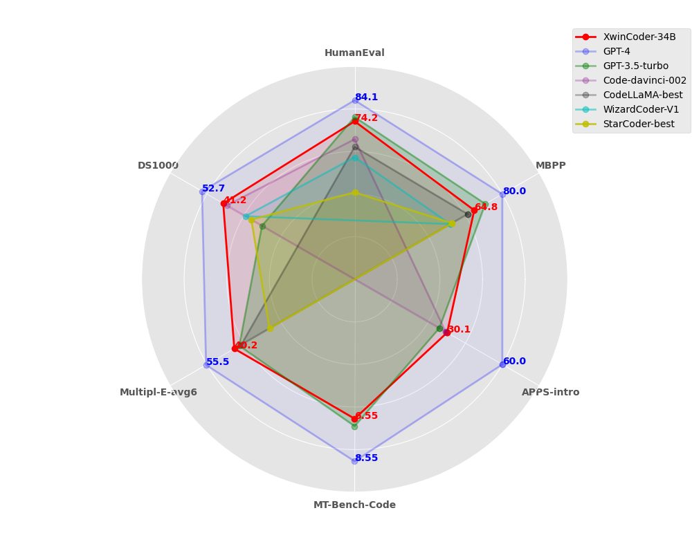

# XwinCoder Eval

<!-- [](CODE_LICENSE)
[](DATA_LICENSE)
[](MODEL_WEIGHTS_LICENSE)
[](https://www.python.org/downloads/release/python-390/) -->

This folder contains code and resources to evaluate and reproduce the results of XwinCoder, a member of the [Xwin-LM](https://github.com/Xwin-LM/Xwin-LM) family dedicated for coding capability. It also serves as a complete codebase for evaluating code-related capabilities of instruction-aligned models (note existing codebases like [bigcode-evaluation-harness](https://github.com/bigcode-project/bigcode-evaluation-harness/tree/main) are designed for pretrained base models). The repository is designed to facilitate ablation experiments and reduce set-up burden, as tasks are separated into individual components instead of integrated into a single framework.  

## Updates

- ❗We released  [**XwinCoder-7B-base-codellama**](https://huggingface.co/), [**XwinCoder-13B-base-codellama**](https://huggingface.co/), [**XwinCoder-34B-base-codellama**](https://huggingface.co/)

- ❗We support codebase to evaluate instruction finetuned models on [HumanEval](HumanEval/README.md), [MBPP](MBPP/README.mb), [APPS](APPS/README.mb), [DS1000](DS1000/README.mb), [Multipl-E](Multipl_E/README.md) and [MT-Bench](MT_bench/README.mb)

## Overview



* To fully demonstrate our model's coding capabilities in real-world usage scenarios, we have conducted thorough evaluations on several existing mainstream coding capability leaderboards (rather than only on the currently most popular HumanEval).   
* As shown in the radar chart, our 34B model **achieves comparable performance as GPT-3.5-turbo on benchmarks**. Note that, to ensure accurate visualization, our radar chart has not been scaled (only translated; MT-Bench score is scaled by 10x to be more comparable with other benchmarks).

## Contents

1. [Setting Up](#setting-up)
2. [Chat Demo](#chat-demo)
3. [Evaluation](#evaluation)
4. [Further Details](#further-details)

## Setting Up

We will use [vllm](https://github.com/vllm-project/vllm) to generate responses during all evaluations. This library will update your pytorch into version 2.0+. So we suggest starting with a docker that support higher version of CUDA and pytorch. For example:

```bash
sudo docker run -it -p 8022:22 -d --name=<docker name> --privileged --net=host --ipc=host --gpus=all -v /:/data superbench/dev:cuda11.8 bash
sudo docker exec -it <docker name> bash
```
Then, run:
```bash
pip install -r requirements.txt
```
This will install all packages needed during generation. For [DS1000](DS1000/README.md), [Multipl-E](Multipl_E/README.md) and [MBPP](MBPP/README.md), We only generate responses using this docker, execution and evaluation will be done in another envirenment or repository. You can check README.md in the folder of each task for further details.

❗Note: the latest vllm does not support running on H100 yet, if you want to evaluate using H100, tag vllm=0.1.7 in the `requirements.txt`. 

## Chat Demo

We provide a chat demo for you to quick check the generation performance. Run:
```bash
python online_chater.py --model <model path or name>
```
and you can interact with our models. 

Here are some examples:


## Evaluation

As mentioned before, this repository is targeting instruction finetuned models. For all tasks, we provide generation codes that modify tasks into forms that align with the intructions used in the models and generate. Then the generated responses are processed into forms of evaluators. The evaluators, including code execution and checking correctness, are adapted from original benchmark websites or directly use [bigcode-evaluation-harness](https://github.com/bigcode-project/bigcode-evaluation-harness/tree/main) to ensure correctness and fairness.

Specific evaluation scripts are in the folder of each task.

## Further Details

1. Known issues:
    - As our models are trained on the newest torch and transformers, it was observed that evaluating on torch 1.x and very old version of transformers may cause a 2-3% drop on results.
